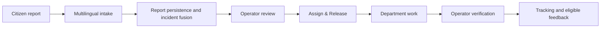

# CivicOps AI

An intelligent community incident and response coordination platform designed for multilingual, accessible civic reporting and human-supervised operational response.

## Overview

CivicOps AI turns citizen reports into structured, persistent incidents for human operators and assigned departments. Designed around Pakistan's multilingual reporting needs, it connects reporting, incident intelligence, field work, verification and citizen feedback.

## Problem

Fragmented complaints, duplicate reports, language barriers, weak routing, limited visibility and accessibility challenges make civic response difficult to coordinate and track.

## Solution

A simple web report feeds structured AI intake and conservative incident fusion. Operators review recommendations and release assignments. Departments record work and submit completion; operators confirm final resolution before eligible citizens provide feedback.

## Key Features

- English, Urdu and Roman Urdu reporting; anonymous text-only submissions.
- Citizen signup, login/logout, session restoration and password reset.
- Manual landmarks, optional GPS, and private image/audio evidence.
- Structured AI classification and summaries; separate reported urgency, priority, evidence confidence and spam risk.
- Durable idempotency and multiple reports linked to one persistent incident.
- Operator Command Center: filters, evidence, plan review, Assign & Release and completion verification.
- Isolated Department Dashboard: trusted identity, queue counts, filters, shared map, work updates and completion submission.
- Real status/assignment history, audit logging, versioned operational actions, tracking and eligible resolution feedback.

## System Workflow



AI extracts facts, rules match/prioritize/route, and humans approve plans and resolution. See [architecture and lifecycle](docs/ARCHITECTURE.md).

## Architecture

```text
React / Vite
  ├─ Supabase Auth → access token
  ├─ shared Leaflet map → MapTiler Streets raster
  └─ Bearer API requests → FastAPI
                           ├─ Groq structured intake
                           └─ server-only Supabase client
                              ├─ Auth token verification
                              ├─ PostgreSQL repositories + operational RPCs
                              └─ private report-evidence Storage
```

Trusted roles/membership come from profiles. Protected data and operational writes go through FastAPI. The browser uses Supabase directly for Auth and an optional RLS-protected department display-name read; it never receives the server secret.

## Roles

| Role | Implemented access |
| --- | --- |
| Citizen | Report, track allowed reports, upload owned evidence, submit eligible feedback |
| Operator | Command Center, verify/review, assign/release, plan review, notes, final resolution/reopen |
| Department | Own released assignments/evidence, accept/start/update/submit completion |
| Admin | Same implemented operational capabilities as Operator; no separate admin UI |

Public signup creates CITIZEN. Elevated accounts use trusted provisioning. See [Department Portal](docs/DEPARTMENT_PORTAL.md).

## Technology Stack

| Layer | Technologies |
| --- | --- |
| Frontend | React 18, TypeScript, Vite 5, Tailwind CSS 4, React Router, Lucide, Leaflet/React Leaflet, Supabase JS |
| Backend | Python 3.12, FastAPI, Pydantic 2, Groq SDK, Supabase Python SDK, Pillow, FFmpeg/ffprobe |
| Infrastructure/configuration | Supabase Auth/PostgreSQL/Storage, MapTiler, Railway backend, Vercel frontend |

## Repository Structure

```text
backend/
  models/          API models/enums
  routes/          Reports, auth, incidents, department, dashboard, media, feedback
  repositories/    Supabase persistence
  services/        Intake, fusion, operations, evidence
  sql/             Migrations/RPCs
  tests/           Deterministic tests and opt-in live verifiers
  tools/           Private-bucket provisioning
  Dockerfile
frontend/
  src/
    auth/          Session provider and role guards
    components/    Shared map, evidence, navigation, history
    pages/         Citizen, account, tracking, operational portals
    services/      Typed API adapters, Auth/session/account clients
    utils/         Filtering, presentation, map helpers
  tests/
  vercel.json
docs/              Product, architecture, API, deployment, verification
railway.json
.dockerignore
```

## Local Development

Use Python 3.12 and Node.js 24.x. Install FFmpeg and ffprobe on PATH for audio processing.

From the repository root, PowerShell:

```powershell
py -3.12 -m venv backend/.venv
backend/.venv/Scripts/Activate.ps1
python -m pip install -r backend/requirements.txt
Copy-Item backend/.env.example backend/.env
Copy-Item frontend/.env.example frontend/.env
Push-Location frontend
npm ci
Pop-Location
```

Copy examples only if destination files are absent; preserve existing environment values. On POSIX use `python3.12 -m venv backend/.venv`, `source backend/.venv/bin/activate` and `cp`.

## Environment Variables

Backend `backend/.env`:

```dotenv
SUPABASE_URL=https://YOUR_PROJECT.supabase.co
SUPABASE_SECRET_KEY=YOUR_SERVER_SECRET
GROQ_API_KEY=YOUR_SERVER_GROQ_KEY
LLM_MODEL=YOUR_SUPPORTED_GROQ_MODEL
APP_ENV=development
FRONTEND_ORIGINS=http://localhost:5173,http://127.0.0.1:5173
```

Frontend `frontend/.env`:

```dotenv
VITE_API_URL=http://127.0.0.1:8000
VITE_SUPABASE_URL=https://YOUR_PROJECT.supabase.co
VITE_SUPABASE_PUBLISHABLE_KEY=sb_publishable_REPLACE_WITH_PUBLIC_KEY
VITE_MAPTILER_API_KEY=YOUR_BROWSER_MAP_KEY
```

Never expose SUPABASE_SECRET_KEY or GROQ_API_KEY in frontend code, Vite variables or source control. Restrict the browser MapTiler key to intended origins. Vite variables are embedded at build time: restart locally or rebuild/redeploy after changes. Missing MapTiler configuration shows a graceful fallback; production builds require the three API/Auth variables.

## Database / Supabase Setup

Tables: profiles, departments, reports, report_media, incidents, incident_reports, incident_assignments, incident_status_history, resolution_feedback and audit_logs. RLS is enabled. Reports keep intake state separate from incident operations; many reports may link to one incident.

**This repository is not a complete empty-database bootstrap.** Base DDL, seeds, RLS and the citizen-only profile trigger must already exist. Follow [SQL applicability/order](backend/sql/README.md). Do not rerun one-time migrations or restore historical Stage 4 RPCs over the department workflow.

For a new environment, provision/verify private evidence storage:

```powershell
python -m backend.tools.prepare_storage
```

Configure Auth redirect URLs using [deployment readiness](docs/DEPLOYMENT_READINESS.md).

## Running Frontend

From frontend/:

```powershell
npm run dev
```

Open http://127.0.0.1:5173; use one origin consistently for PKCE links.

## Running Backend

With the virtual environment activated, from the repository root:

```powershell
uvicorn backend.main:app --reload
```

API: http://127.0.0.1:8000; liveness: /health; generated API docs: /docs. See [backend guide](backend/README.md) and [API contracts](docs/API_CONTRACT.md).

## Testing

```powershell
backend/.venv/Scripts/python.exe -m pytest backend/tests -q
Push-Location frontend
npm test
npm run build
npm run lint
Pop-Location
git diff --check
```

Build includes TypeScript checking. See [testing and demo verification](docs/TESTING.md) for coverage, live checks and manual acceptance.

## Deployment

Railway uses root railway.json and backend/Dockerfile; Vercel uses root directory frontend. [Deployment readiness](docs/DEPLOYMENT_READINESS.md) documents exact settings. Repository configuration does not establish live deployment status.

## Security Model

FastAPI verifies tokens and explicit roles. Department access requires trusted active membership, current department, active assignment and released work state. Server-only RPCs recheck authorization and commit operational history/audits atomically. UI actions send expected_updated_at to reject stale edits.

Evidence is content-validated and privately served through authorized endpoints. Idempotency prevents duplicate retries. Safe tracking omits private notes/actor IDs. Anonymous tracking remains readable by holders of its high-entropy report ID; it is not authenticated ownership. Media resource limits are per process, not distributed abuse prevention. These controls are not production security certification.

## Limitations / Current Scope

Web intake only. WhatsApp/SMS, notifications, offline synchronization, embeddings, advanced analytics, government integration, multi-department membership and department completion photos are future scope.

Priority/trust scores use simple rules; uploaded media does not automatically rescore intelligence. Response plans are templates, not automatic dispatch. Fusion/storage metadata writes have retry recovery rather than cross-service atomicity. Background AI retry/reconciliation, distributed intake abuse prevention and retention/orphan cleanup are absent. Full interface translation and browser/hosting acceptance remain separate checks.

## Team Members

| Member | Role |
| --- | --- |
| Muhammad Furqan Arshad | Team Lead, System Architecture & Integration |
| Ghulam Mohy Ud Din | Backend & AI Systems Lead |
| Muhammad Huzaifa Shamas | Frontend & Command Center Lead |
| Aleeba Pervaiz | QA & System Validation Lead |
| Khadeeja Ameen | AI Evaluation & Community Experience Lead |
| Muhammad Ali | Incident Intelligence & Operations Coordinator |

PakAngel's Generative AI Hackathon — Final (2nd) Hackathon. Theme: **Build Intelligent Agents to Reshape the Future, Unlock Potential & Drive Innovation**.
