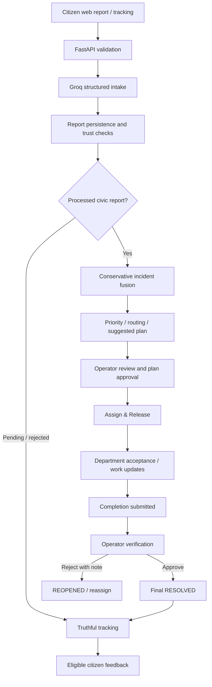
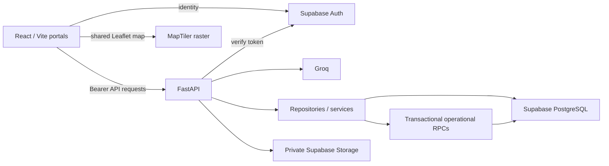
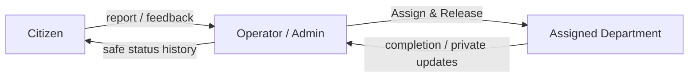
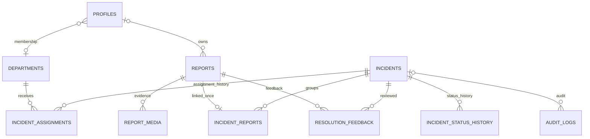

# CivicOps AI architecture

Authoritative current architecture, permissions and lifecycle. See [API contracts](API_CONTRACT.md), [product scope](PRODUCT.md), [Department Portal](DEPARTMENT_PORTAL.md) and [deployment](DEPLOYMENT_READINESS.md).

## System flow and components





FastAPI uses the server secret; the browser never does. Supabase Auth verifies identity and FastAPI reads trusted profiles.role/membership on each authorized request. The browser directly uses Auth and optionally reads the matching department display name under RLS for presentation only. Protected operational data/writes use FastAPI.

Routes delegate to repositories and services; adapters preserve public field names without persisting API-only fields in reports.

## Reports and location

ReportCreate accepts submission_id, text, language, latitude, longitude, landmark_text and legacy image_url. UI languages are en, ur, roman_urdu; backend language remains a string, not an enforced enum.

Manual landmarks are valid without GPS; whitespace becomes null. Coordinates and landmark text persist independently. No location is also accepted; no geocoder invents coordinates. Tracking and both dashboards show text-only locations; missing/invalid coordinate pairs simply omit a map marker.

Groq extraction validates category against the allowed enum. After removing an optional groq/ prefix, the exact model names openai/gpt-oss-120b and openai/gpt-oss-20b use strict json_schema; other models use json_object plus Pydantic validation. Failed/invalid AI output remains PENDING/AI_PENDING with no incident, not successful fallback processing. Injection-suspected reports persist rejection and return 400; non-civic reports are not fused. There is no background AI retry worker.

Report processing values are RECEIVED, AI_PENDING, PROCESSED, LINKED, NEEDS_REVIEW, REJECTED. The route primarily writes AI_PENDING, PROCESSED/REJECTED, then LINKED. These are separate from incident operational status.

Database report IDs are UUIDs; public IDs are random CV- identifiers. UNIQUE(idempotency_scope, submission_id) enforces PUBLIC or USER:<verified UUID> retries. Idempotency-Key may override the durable key. A private fingerprint in JSON signals supports conflict detection and is filtered from API signals. Matching replay returns original IDs, HTTP 201 and idempotent_replay=true; changed payload reuse returns 409. Browser attempt IDs survive retries only while that draft/page is alive.

## AI, rules and human decisions

| Responsibility | Actual implementation |
| --- | --- |
| AI | Category, summary, reported urgency, civic relevance and suspected injection extraction |
| Priority | Non-civic LOW; civic CRITICAL/HIGH when claimed; otherwise MEDIUM, including LOW claims |
| Evidence confidence | Baseline .6, +.2 for both coordinates, +.2 for legacy image_url presence; cap 1 |
| Spam risk | .8 for trimmed text shorter than five characters; otherwise .05 |
| Routing | Category-to-seeded-department mapping; OTHER → MANUAL_REVIEW |
| Response plan | Three-step template; no generative operational planning or automatic dispatch |
| Human decisions | Verification, assignment/release, plan review, final resolution/reopen |

Reported urgency is not final priority. Evidence confidence and spam risk are separate heuristics, not calibrated probabilities. image_url is a legacy input, not proof of validated evidence. Image/audio uploads follow report creation and do not automatically rescore intelligence.

Categories: SEWERAGE_DRAINAGE, WASTE_SANITATION, WATER_SUPPLY, ELECTRICITY, STREET_LIGHTING, ROAD_DAMAGE, GAS_UTILITIES, PARKS_HORTICULTURE, STRAY_ANIMALS_SAFETY, OTHER.

Department keys: WATER_SANITATION, WATER_SUPPLY, WASTE_MANAGEMENT, ROAD_MAINTENANCE, PUBLIC_LIGHTING, ELECTRICITY_UTILITY, GAS_UTILITY, PARKS_HORTICULTURE, ANIMAL_CONTROL, MANUAL_REVIEW.

## Conservative fusion

Candidates share category, are active/unarchived and were created within the preceding 24 hours. Comparisons anchor to the seed report to avoid matching-chain drift. Content agreement is token-set Jaccard similarity, taking the smaller original-text/summary score when both summaries exist.

| Case | Required agreement |
| --- | --- |
| Both coordinate pairs exist | <=40 metres; <=24 hours; landmark >=.85; content >=.75; weighted score >=.85 |
| Either pair absent | Exact landmark token set with >=3 tokens; <=6 hours; content >=.90; weighted score >=.94 |

Weights with coordinates: content .35, landmark .30, Haversine proximity .25, time .10. Without: content .60, landmark .30, time .10. Both require a shared specific site marker, >=4 incoming text tokens, category other than OTHER and both spam scores <.5. A road name alone is insufficient. A gap <.08 between the best two eligible matches creates a new incident.

incident_reports stores score/method/details: TOKEN_SIMILARITY_DISTANCE_TIME_V1 or NEW_INCIDENT_V1. This is lexical matching, not embeddings, independent-source validation or media corroboration. Full match details/location confidence are not exposed in incident API responses.

Report count derives from links. Confidence/spam use maximum existing/linked scores; priority retains the highest existing/rules-derived priority. Signals deduplicate; existing summary/location, operational status, department and approval are preserved.

Fusion uses multiple PostgREST writes. Stable IDs, uniqueness, replay repair and bounded updated_at compare-and-swap retries recover partial work. It is not a single transaction; abandoned seeds or concurrent duplicate incidents can remain without a reconciliation worker.

## Roles and permissions

| Capability | Citizen | Operator | Department | Admin |
| --- | --- | --- | --- | --- |
| Submit web report | Yes; anonymous also allowed | Yes | Yes | Yes |
| Track owned report / evidence | Owner | Operational access | Owner only; others' evidence requires assigned-incident access | Operational access |
| Eligible feedback | Citizen owner only | No | No | No |
| Operator dashboard / summary | No | Yes | No | Yes |
| Department queue / evidence | No | Operator endpoints | Own released assignment only | Operator endpoints |
| Verify/review, assign/release | No | Yes | No | Yes |
| Review plan / private Operator notes | No | Yes | No | Yes |
| Accept/start/submit completion | No | No | Own assignment only | No |
| Department work updates | No | Read for review | Own department only | Read for review |
| Final resolution / reopen | No | Allowed transitions | No | Allowed transitions |
| Public role promotion / admin UI | None | None | None | None |

Admin shares implemented Operator capabilities; there is no separate administrative API. Signup trigger explicitly creates CITIZEN regardless of metadata. Trusted provisioning sets elevated roles/membership. Department does not inherit Operator privileges.



## Canonical incident lifecycle

Source: [operations.py](../backend/services/operations.py) and [department_portal.sql](../backend/sql/department_portal.sql).

```mermaid
stateDiagram-v2
  [*] --> RECEIVED
  RECEIVED --> VERIFIED: Operator / Admin
  VERIFIED --> ASSIGNED: Assign & Release
  ASSIGNED --> ACCEPTED: Department
  ACCEPTED --> IN_PROGRESS: Department; approved plan
  IN_PROGRESS --> RESOLVED_PENDING_VERIFICATION: Department; completion note
  RESOLVED_PENDING_VERIFICATION --> RESOLVED: Operator / Admin
  RESOLVED_PENDING_VERIFICATION --> REOPENED: Operator / Admin; rejection note
  RESOLVED --> REOPENED: Operator / Admin
  REOPENED --> ASSIGNED: Operator / Admin release
  RECEIVED --> NEEDS_REVIEW
  VERIFIED --> NEEDS_REVIEW
  ASSIGNED --> NEEDS_REVIEW
  ACCEPTED --> NEEDS_REVIEW
  IN_PROGRESS --> NEEDS_REVIEW
  REOPENED --> NEEDS_REVIEW
  NEEDS_REVIEW --> VERIFIED: Operator / Admin
  NEEDS_REVIEW --> REJECTED: Operator / Admin; reason
```

| From | To | Actor | Condition |
| --- | --- | --- | --- |
| RECEIVED | VERIFIED, NEEDS_REVIEW | Operator / Admin | Current version |
| NEEDS_REVIEW | VERIFIED | Operator / Admin | Current version |
| NEEDS_REVIEW | REJECTED | Operator / Admin | Nonblank reason |
| VERIFIED | ASSIGNED | Operator / Admin | Current department + matching active assignment |
| VERIFIED | NEEDS_REVIEW | Operator / Admin | Current version |
| ASSIGNED | ACCEPTED | Department | Active membership + matching active assignment |
| ASSIGNED | NEEDS_REVIEW | Operator / Admin | Current version |
| ACCEPTED | IN_PROGRESS | Department | Same assignment; plan exactly APPROVED |
| ACCEPTED | NEEDS_REVIEW | Operator / Admin | Current version |
| IN_PROGRESS | RESOLVED_PENDING_VERIFICATION | Department | Same assignment; nonblank completion note |
| IN_PROGRESS | NEEDS_REVIEW | Operator / Admin | Current version |
| RESOLVED_PENDING_VERIFICATION | RESOLVED | Operator / Admin | Human completion verification |
| RESOLVED_PENDING_VERIFICATION | REOPENED | Operator / Admin | Nonblank rejection note |
| RESOLVED | REOPENED | Operator / Admin | Current version |
| REOPENED | ASSIGNED | Operator / Admin | Current department + matching active assignment |
| REOPENED | NEEDS_REVIEW | Operator / Admin | Current version |
| REJECTED | None | — | Terminal |

Notes have a 2,000-character limit. No direct RECEIVED → RESOLVED or IN_PROGRESS → RESOLVED. Department permissions come from backend allowed actions and are rechecked on mutation.

Assign & Release accepts VERIFIED, ASSIGNED, ACCEPTED, IN_PROGRESS, RESOLVED_PENDING_VERIFICATION or REOPENED. It closes prior active assignments and creates a new one, atomically setting/resetting ASSIGNED. Same-department reassignment also requires fresh acceptance. Legacy assignment without release preserves initial review states.

Plan states: PENDING, APPROVED, MODIFIED, REJECTED. MODIFY clears approver/time and needs separate approval. APPROVE requires a nonempty PENDING/MODIFIED plan. Closed incidents reject assignment/plan review. Final resolution has no additional independent approval check; approval is enforced at start-work.

Released Department queue states are only ASSIGNED, ACCEPTED, IN_PROGRESS, RESOLVED_PENDING_VERIFICATION. Reassigned, completed-assignment, inactive, archived, RESOLVED or REOPENED incidents are inaccessible through Department endpoints; there is no completed Department archive.

## Database and transactional operations

| Table | Purpose / relationships |
| --- | --- |
| profiles | Auth identity, trusted role, is_verified, optional department FK |
| departments | Seeded keys/display names and active flag |
| reports | Original submissions, intake/location and retry scope/key |
| report_media | Report FK; private path/type/hash/metadata |
| incidents | Intelligence, current department FK, status and reviewed plan |
| incident_reports | Report/incident FKs; UNIQUE(report_id), many reports per incident |
| incident_assignments | Incident/department, assigned_by/time, optional assigned_to, completion/notes |
| incident_status_history | Incident, old/new text status, changed_by/time/private notes |
| resolution_feedback | Owned linked report/incident response; unique pair |
| audit_logs | Actor/context, actions and old/new/details |



Roles/statuses are text checks, not PostgreSQL enums. Baseline history has no status checks; RPC policy enforces transitions. Audit actor types remain SYSTEM, AI, USER, OPERATOR, ADMIN. Department uses USER with trusted role/user/department details.

Operational RPCs use SECURITY INVOKER and empty search_path, with EXECUTE for service_role only. FastAPI supplies verified actor UUIDs. Functions recheck roles/membership, lock rows, check expected_updated_at and write operational change/history/audit in one transaction. The release wrapper nests assignment/status functions atomically.

expected_updated_at is optional in API models for compatibility; UI always supplies it. Omission makes FastAPI supply its freshly read version, protecting that read/write race rather than an old client's stale state. Operator notes are one audit insert without incident-version checking.

## Sessions, tracking, feedback, evidence and maps

Initial session restoration and concurrent verification deduplicate. Same-identity events/tab focus/routes do not fully reverify profiles. Token refresh silently updates bearer state; signout clears immediately, and account switching clears old trusted identity. Explicit login rechecks. UI identity can await reload/relogin after trusted promotion; server authorization is fresh on requests.

Owned tracking requires owner or Operator/Admin. Anonymous unowned reports remain readable by their public ID; sign-in cannot claim ownership. Safe history omits notes/actor IDs. CITIZEN feedback requires ownership, a real link, final RESOLVED and no previous pair response. YES/PARTIALLY/NO write feedback/audit atomically; NO/PARTIALLY flag review without automatic reopening/worker.

Private evidence uses owner-only upload and owner/Operator/Admin or assigned-Department reads. MIME, extension and content are validated; images normalize to JPEG and audio to WebM/Opus, stripping metadata. Paths/hashes persist, not public URLs. Storage plus metadata cannot share a transaction; retries reconcile retained objects.

Both dashboards use one shared IncidentMap with MapTiler Streets-v4 256px XYZ tiles and MapTiler/OpenStreetMap attribution. Missing key means no raster requests. Operator map follows filtered incidents; Department map shows all authorized queue rows, independent of local list filters. Marker/list selection synchronizes; filters/selection preserve map lifecycle. Null coordinates preserve text/list/detail without a marker.

Leaflet marker icon images currently load from the versioned Leaflet 1.9.4 assets on unpkg; network access to that CDN is also needed for those icons.

## Current limits

No embeddings, media corroboration, automatic dispatch/reopening, notifications, WhatsApp/SMS, offline sync, multi-department accounts, department completion photos or public role administration. Media has two processing slots per backend process, not a distributed/general intake limiter. Base schema/RLS/seeds and a live migration ledger are not supplied. See [testing limits](TESTING.md).
